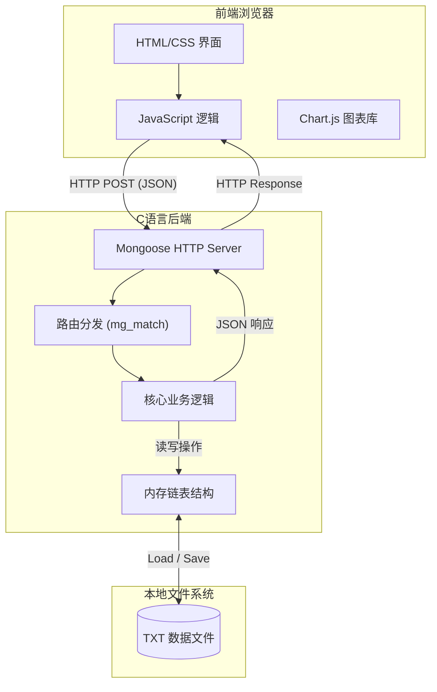
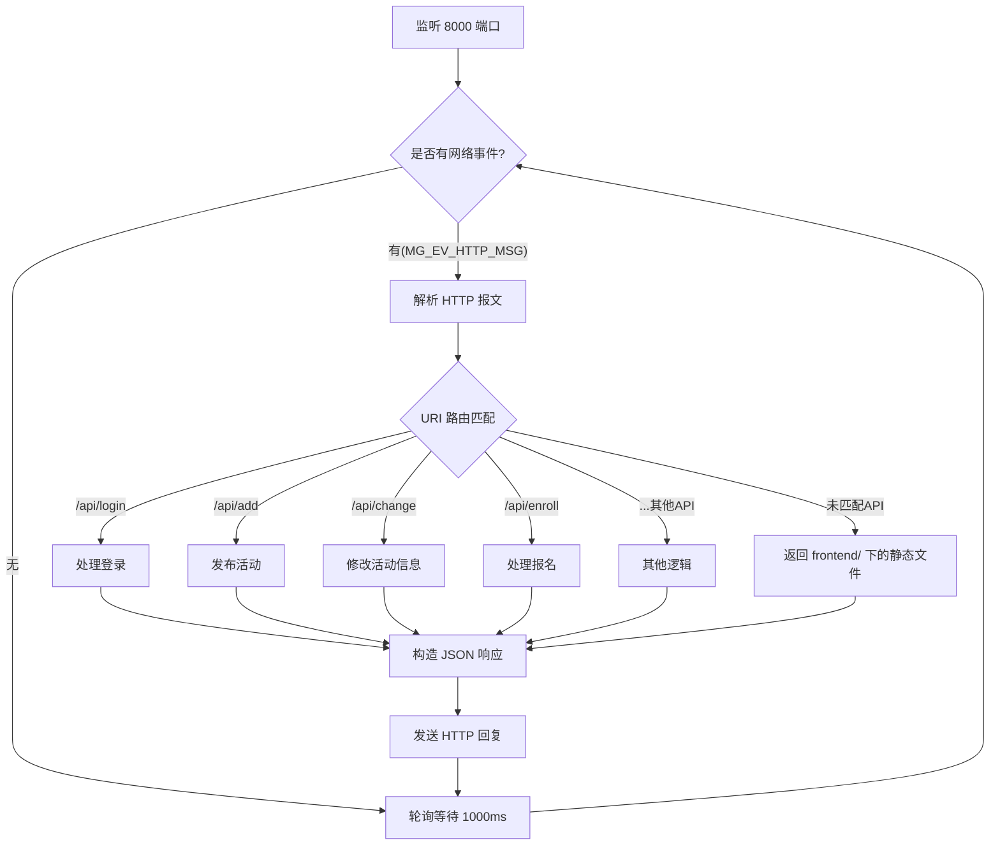
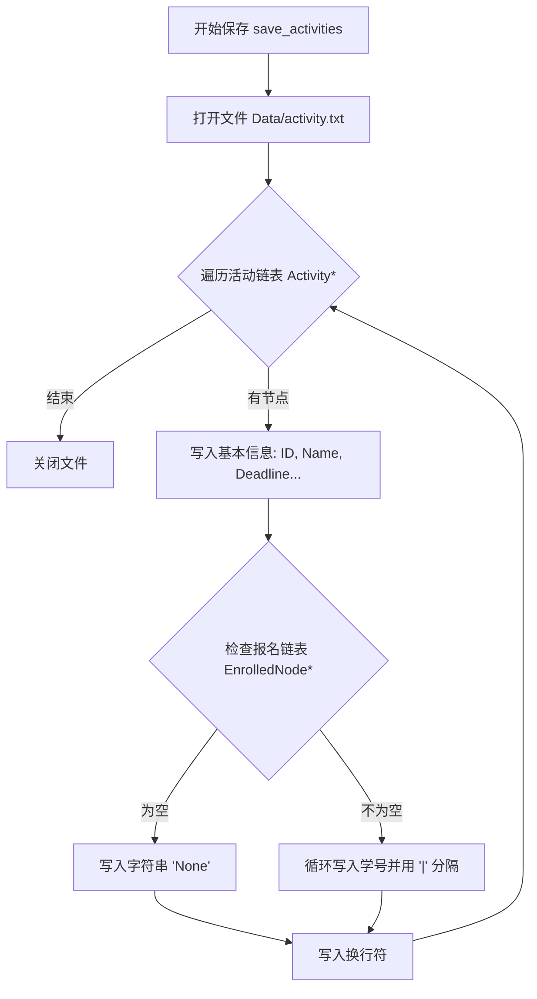
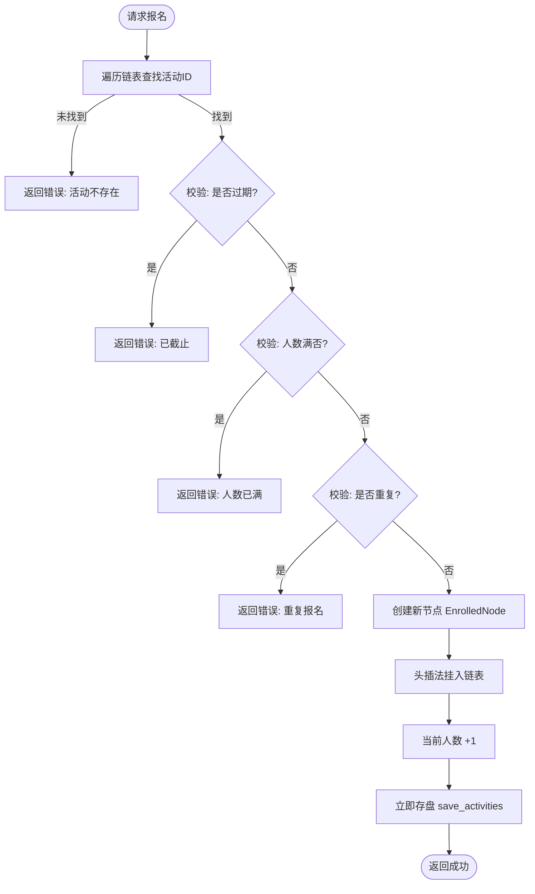
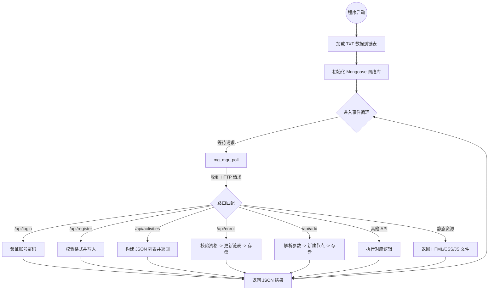

# 课程设计报告：社团活动管理系统

## 1. 需求分析

本系统旨在为校园社团提供一个轻量级、可视化的活动管理平台。系统需满足以下功能与非功能需求：

### 1.1 功能需求
*   **用户权限管理**：
  *   **普通学生**：注册账号、登录系统、浏览活动列表、报名参加活动、查看已报名状态。
  *   **管理员**：登录后台、发布新活动（包含时间、地点、人数限制）、删除违规或过期活动、查看活动的具体报名学生清单、查看活动统计图表。
*   **数据校验**：
  *   注册时需校验学号格式。
  *   发布活动时需校验日期格式。
  *   报名时需校验是否满员、是否过期、是否重复报名。

### 1.2 非功能需求
*   **图形化界面 (GUI)**：摒弃传统的命令行交互，采用 Web 界面提供良好的用户体验。
*   **数据持久化**：系统关闭后数据不丢失，需保存至本地文件。

## 2. 项目结构

本项目采用 B/S（Browser/Server）架构风格的变体，文件组织结构如下：

```text
Root/
├── Data/                  # 数据持久化层
│   ├── activity.txt       # 存储活动信息（ID, 名称, 类别, 时间, 状态, 报名表）
│   ├── student.txt        # 存储学生账号信息（学号, 姓名, 密码, 班级）
│   └── trash.txt          # 回收站，存储被删除活动的备份日志
├── frontend/              # 视图层 (View)
│   ├── admin.html         # 管理员控制台（含图表统计、活动发布）
│   ├── index.html         # 登录/注册入口页面
│   └── student.html       # 学生操作中心（活动浏览、筛选、报名）
├── main.c                 # 控制层 (Controller) & 模型层 (Model) - 核心业务逻辑
├── mongoose.c             # 网络通信核心库
└── mongoose.h             # 网络通信头文件
```

## 3. 总体设计

本系统采用了**前后端分离**的设计思想：

*   **后端 (C Language)**：利用 `Mongoose` 网络库构建 HTTP 服务器。它负责监听端口、解析 JSON 数据、执行业务逻辑（如查重、写入文件）、并返回 JSON 响应。后端不负责页面的渲染，只负责数据的处理。
*   **前端 (HTML/JS)**：通过 `Fetch API` 向后端发送异步请求。负责界面的展示、用户输入的初步校验以及根据后端返回的数据动态更新 DOM 元素。

### 系统架构图 (Mermaid Component Diagram)



这是一份针对你提供的最新代码（包含了 `/api/change` 接口和 `Data/` 路径处理）编写的**关键模块详细设计文档**。

你可以将这部分内容替换或添加到之前文档的 **“4. 模块详细设计”** 部分。

---

## 4. 关键模块详细设计与实现

本系统采用 C 语言编写后端逻辑，核心模块包括：网络通信与路由分发、数据持久化存储、核心业务逻辑（报名与校验）、以及自动状态管理。以下是各模块的详细实现流程与关键代码。

### 4.1 网络通信与路由分发模块

**功能描述**：
基于 `Mongoose` 网络库，系统运行在一个无限循环的事件侦听器中。当收到 HTTP 请求时，`fn` 回调函数被触发，根据请求的 URI（如 `/api/login`, `/api/add`）将请求分发给不同的处理逻辑。

**处理流程图 (Mermaid)**：



**关键代码实现 (`fn` 函数片段)**：

```c
static void fn(struct mg_connection *c, int ev, void *ev_data, void *fn_data) {
    if (ev == MG_EV_HTTP_MSG) {
        struct mg_http_message *hm = (struct mg_http_message *) ev_data;
        // ... (读取 body 逻辑)

        // 路由分发示例
        if (mg_match(hm->uri, mg_str("/api/login"), NULL)) {
            // 处理登录逻辑...
        } 
        else if (mg_match(hm->uri, mg_str("/api/change"), NULL)) {
            // 处理活动修改逻辑...
        }else if
        //其他api...
        }else {
            // 静态文件服务：前端页面
            struct mg_http_serve_opts o = {.root_dir = "./frontend"};
            mg_http_serve_dir(c, hm, &o);
        }
    }
}
```

---

### 4.2 数据持久化存储模块

**功能描述**：
系统使用链表（Linked List）在内存中管理数据，使用文本文件（TXT）在硬盘中持久化数据。为了支持“一个活动对应多个学生”的结构，`save_activities` 函数采用了特殊的序列化格式。

**存储格式**：
`ID 名称 类别 地点 容量 状态 截止时间 报名学号1|报名学号2|...`

**保存活动流程图 (Mermaid)**：



**关键代码实现 (`save_activities`)**：

```c
void save_activities() {
    FILE *fp = fopen("Data/activity.txt", "w"); // 指定 Data 目录
    if (!fp) return;
    Activity *curr = activity_head;
    while (curr) {
        check_expiry(curr); // 保存前先更新过期状态
        // 1. 写入基本属性
        fprintf(fp, "%d %s %s %s %d %s %s ", curr->id, curr->name, curr->category, 
                curr->location, curr->max_capacity, curr->status, curr->deadline);
        // 2. 写入嵌套的报名名单
        if (!curr->enrolled_head) fprintf(fp, "None");
        else {
            EnrolledNode *e = curr->enrolled_head;
            while (e) {
                fprintf(fp, "%s", e->student_id);
                if (e->next) fprintf(fp, "|"); // 学号间用竖线分隔
                e = e->next;
            }
        }
        fprintf(fp, "\n");
        curr = curr->next;
    }
    fclose(fp);
}
```

---

### 4.3 核心业务：报名与校验模块

**功能描述**：
学生报名是系统的核心交互。后台必须保证数据的完整性和逻辑的正确性，因此在 `enroll_student` 函数中实施了严格的**四重校验**。

**校验流程图 (Mermaid)**：



**关键代码实现 (`enroll_student`)**：

```c
int enroll_student(int act_id, const char *stu_id) {
    Activity *curr = activity_head;
    while (curr) {
        if (curr->id == act_id) {
            check_expiry(curr); // 1. 实时检查时间状态
            
            // 2. 状态与容量校验
            if (strcmp(curr->status, "已结束") == 0) return -2;
            if (curr->current_count >= curr->max_capacity) return -1;
            
            // 3. 查重校验 (遍历内部链表)
            EnrolledNode *chk = curr->enrolled_head;
            while (chk) {
                if (strcmp(chk->student_id, stu_id) == 0) return 0;
                chk = chk->next;
            }
            
            // 4. 执行写入
            EnrolledNode *node = (EnrolledNode *) malloc(sizeof(EnrolledNode));
            strcpy(node->student_id, stu_id);
            node->next = curr->enrolled_head; // 头插法
            curr->enrolled_head = node;
            curr->current_count++;
            
            save_activities(); // 数据落盘
            return 1;
        }
        curr = curr->next;
    }
    return -404;
}
```

---

### 4.4 状态自动维护模块 (Time Check)

**功能描述**：
为了避免人工维护活动状态，系统利用 C 语言的 `time.h` 库，在每次读取或写入活动时，自动比对“当前系统时间”与“活动截止时间”。由于采用了 `YYYYMMDD` 格式，可以直接使用 `strcmp` 进行高效比较。

**关键代码实现**：

```c
// 格式化时间为 20250114 形式
void get_current_time_str(char *buffer) {
    time_t t = time(NULL);
    struct tm *tm_info = localtime(&t);
    sprintf(buffer, "%04d%02d%02d",
            tm_info->tm_year + 1900, tm_info->tm_mon + 1, tm_info->tm_mday);
}

// 自动更新状态机
void check_expiry(Activity *act) {
    char now[25];
    get_current_time_str(now);
    // 字符串比较: ASCII码比较，"20250115" > "20250114"
    if (strcmp(now, act->deadline) > 0) {
        strcpy(act->status, "已结束");
    } else {
        // 支持状态回滚（如管理员延长了截止日期）
        if (strcmp(act->status, "已结束") == 0)
            strcpy(act->status, "报名中");
    }
}
```

### 4.5 活动信息修改模块 (Update Logic)

**功能描述**：
`/api/change` 接口允许管理员修改已发布活动的信息。该模块不仅更新内存中的数据，还包含对时间格式的合法性校验。

**关键代码实现**：

```c
// 在 fn 函数路由中
else if (mg_match(hm->uri,mg_str("/api/change"),NULL)){
    // ... 解析 JSON 参数 ...
    
    Activity *curr = activity_head;
    while (curr) {
        if (curr->id == aid) {
            // 简单的格式校验 (防止非法日期)
            if (ddl[4]=='1' && ddl[5]>'2' && ddl[5]<='9') { // 简易逻辑示意
                flag = 2; break; 
            }
            
            // 更新内存数据
            strcpy(curr->name, name);
            strcpy(curr->deadline, ddl);
            curr->max_capacity = max;
            // 修改后默认重置为报名中，由 check_expiry 后续自动判断
            strcpy(curr->status, "报名中"); 
            
            save_activities(); // 立即保存
            flag = 1; break;
        }
        curr = curr->next;
    }
    // ... 返回 JSON 结果 ...
}
```
## 5. 详细流程设计

### 5.1 后端处理流程图



### 5.2 接口定义 (API Specification)

所有接口均采用 HTTP POST 方法，数据格式为 JSON。

| 接口 URL          | 功能描述 | 请求参数 (JSON)                       | 返回示例                                      |
| ----------------- | -------- | ------------------------------------- | --------------------------------------------- |
| `/api/login`      | 用户登录 | `{username, password}`                | `{"status":"success", "role":"student"}`      |
| `/api/register`   | 学生注册 | `{sid, name, password, phone, class}` | `{"status":"success"}`                        |
| `/api/activities` | 获取列表 | *无*                                  | `[{"id":1001, "name":"...", ...}]`            |
| `/api/add`        | 发布活动 | `{name, category, deadline, ...}`     | `{"status":"added"}`                          |
| `/api/enroll`     | 报名活动 | `{aid, student_id}`                   | `{"status":"success"}` 或 `{"status":"full"}` |
| `/api/delete`     | 删除活动 | `{aid}`                               | `{"status":"deleted"}`                        |
| `/api/details`    | 获取名单 | `{aid}`                               | `[{"id":"201", "name":"张三", ...}]`          |
| `/api/stats`      | 获取统计 | *无*                                  | `{"academic": 10, "sports": 5, ...}`          |

## 6. 感悟总结

本次课程设计中，我尝试跳出传统的“控制台（Console）程序”思维，挑战性地采用了**前后端分离**的开发模式。利用 C 语言配合 Mongoose 网络库作为后端服务器，与 HTML/JS 前端进行交互，这一过程让我受益匪浅。

1.  **对 C 语言应用场景的拓展**：以往我认为 C 语言仅限于底层开发或算法实现，但通过这次项目，我意识到 C 语言同样可以处理 HTTP 请求，充当 Web 服务器。这让我对 socket 编程和网络协议（特别是 GET/POST 请求的处理）有了更直观的理解。
2.  **前后端交互与 JSON 处理**：由于 C 语言没有原生的 JSON 支持，在处理 API 接口时，我不得不深入研究字符串的拼接与解析。这极大地锻炼了我对 `char*` 指针操作、内存分配（`malloc/free`）以及缓冲区溢出问题的把控能力。
3.  **系统解耦合的优势**：在开发过程中，我发现图形界面（前端）的修改完全不需要重新编译后端的 C 代码，两者的解耦显著提高了开发效率。这种架构思想比单纯的代码实现更为宝贵。
4.  **不足与展望**：目前数据存储仅依赖 TXT 文件，且缺乏完善的并发控制。在未来的学习中，我希望引入 SQLite 数据库来替代文件操作，并增加哈希校验和多线程支持，以提升系统的健壮性。


# 后附C语言后端完整代码

```C
#include "mongoose.h"
#include <stdio.h>
#include <stdlib.h>
#include <string.h>
#include <time.h>
#include <ctype.h>

const char admin[] = "admin";
const char adminPassword[] = "admin123";

//数据结构
typedef struct Student {
    char id[20];
    char name[50];
    char password[50];
    char phone[20];
    char class_name[50];
    struct Student *next;
} Student;

typedef struct EnrolledNode {
    char student_id[20];
    struct EnrolledNode *next;
} EnrolledNode;

typedef struct Activity {
    int id;
    char name[100];
    char category[50];
    char location[100];
    int max_capacity;
    char deadline[25];
    char status[20];
    int current_count;
    EnrolledNode *enrolled_head;
    struct Activity *next;
} Activity;

Student *student_head = NULL;
Activity *activity_head = NULL;
int global_id_counter = 1000;

//获取当前时间字符串
void get_current_time_str(char *buffer) {
    time_t t = time(NULL);
    struct tm *tm_info = localtime(&t);
    sprintf(buffer, "%04d%02d%02d",
            tm_info->tm_year + 1900,
            tm_info->tm_mon + 1,
            tm_info->tm_mday);
}

//检查活动是否结束
void check_expiry(Activity *act) {
    char now[25];
    get_current_time_str(now);
    if (strcmp(now, act->deadline) > 0) {
        strcpy(act->status, "已结束");
    } else {
        // 如果未过期且当前状态是已结束，恢复为报名中(可选)
        if (strcmp(act->status, "已结束") == 0)
            strcpy(act->status, "报名中");
    }
}

//校验学号 4位年份+3位编号  admin保留
int validate_id(const char *id) {
    if (strcmp(id, admin) == 0 || strcmp(id, "ADMIN") == 0) return -1;
    if (strlen(id) != 7) return 0;
    if (id[0] != '2') return 0;
    for (int i = 0; i < 7; i++) if (!isdigit(id[i])) return 0;
    return 1;
}

int get_json_int(const char *json, const char *key) {
    char search[64];
    const char *p;
    sprintf(search, "\"%s\":", key);
    p = strstr(json, search);
    if (!p) return -1;
    return atoi(p + strlen(search));
}

void get_json_str(const char *json, const char *key, char *dest) {
    char search[64];
    const char *p;
    int i = 0;
    sprintf(search, "\"%s\":\"", key);
    p = strstr(json, search);
    if (!p) {
        dest[0] = '\0';
        return;
    }
    p += strlen(search);
    while (*p != '\"' && *p != '\0') dest[i++] = *p++;
    dest[i] = '\0';
}

//数据存储
void save_students() {
    FILE *fp = fopen("Data/student.txt", "w");
    if (!fp) return;
    Student *curr = student_head;
    while (curr) {
        fprintf(fp, "%s %s %s %s %s\n", curr->id, curr->name, curr->password, curr->phone, curr->class_name);
        curr = curr->next;
    }
    fclose(fp);
}

void load_students() {
    FILE *fp = fopen("Data/student.txt", "r");
    if (!fp) return;
    char id[20], n[50], p[50], ph[20], c[50];
    while (fscanf(fp, "%s %s %s %s %s", id, n, p, ph, c) != EOF) {
        Student *node = (Student *) malloc(sizeof(Student));
        strcpy(node->id, id);
        strcpy(node->name, n);
        strcpy(node->password, p);
        strcpy(node->phone, ph);
        strcpy(node->class_name, c);
        node->next = student_head;
        student_head = node;
    }
    fclose(fp);
}

void save_activities() {
    FILE *fp = fopen("Data/activity.txt", "w");
    if (!fp) return;
    Activity *curr = activity_head;
    while (curr) {
        check_expiry(curr); // 保存前更新状态
        fprintf(fp, "%d %s %s %s %d %s %s ", curr->id, curr->name, curr->category, curr->location, curr->max_capacity,
                curr->status, curr->deadline);
        if (!curr->enrolled_head) fprintf(fp, "None");
        else {
            EnrolledNode *e = curr->enrolled_head;
            while (e) {
                fprintf(fp, "%s", e->student_id);
                if (e->next) fprintf(fp, "|");
                e = e->next;
            }
        }
        fprintf(fp, "\n");
        curr = curr->next;
    }
    fclose(fp);
}

void load_activities() {
    FILE *fp = fopen("Data/activity.txt", "r");
    if (!fp) return;
    int id, max;
    char name[100], cat[50], loc[100], stat[20], ddl[25], list[4096];
    while (fscanf(fp, "%d %s %s %s %d %s %s %s", &id, name, cat, loc, &max, stat, ddl, list) != EOF) {
        Activity *node = (Activity *) malloc(sizeof(Activity));
        node->id = id;
        if (id > global_id_counter) global_id_counter = id;
        strcpy(node->name, name);
        strcpy(node->category, cat);
        strcpy(node->location, loc);
        node->max_capacity = max;
        strcpy(node->status, stat);
        strcpy(node->deadline, ddl);
        node->enrolled_head = NULL;
        node->current_count = 0;
        if (strcmp(list, "None") != 0) {
            char *token = strtok(list, "|");
            while (token) {
                EnrolledNode *en = (EnrolledNode *) malloc(sizeof(EnrolledNode));
                strcpy(en->student_id, token);
                en->next = node->enrolled_head;
                node->enrolled_head = en;
                node->current_count++;
                token = strtok(NULL, "|");
            }
        }
        check_expiry(node); // 加载时立即检查
        node->next = activity_head;
        activity_head = node;
    }
    fclose(fp);
}

//run
int register_student(const char *id, const char *name, const char *pwd, const char *ph, const char *cls) {
    Student *c = student_head;
    while (c) {
        if (strcmp(c->id, id) == 0) return 0;
        c = c->next;
    }
    Student *n = (Student *) malloc(sizeof(Student));
    strcpy(n->id, id);
    strcpy(n->name, name);
    strcpy(n->password, pwd);
    strcpy(n->phone, ph);
    strcpy(n->class_name, cls);
    n->next = student_head;
    student_head = n;
    save_students();
    return 1;
}

int enroll_student(int act_id, const char *stu_id) {
    Activity *curr = activity_head;
    while (curr) {
        if (curr->id == act_id) {
            check_expiry(curr);
            if (strcmp(curr->status, "已结束") == 0) return -2;
            if (curr->current_count >= curr->max_capacity) return -1;
            EnrolledNode *chk = curr->enrolled_head;
            while (chk) {
                if (strcmp(chk->student_id, stu_id) == 0) return 0;
                chk = chk->next;
            }
            EnrolledNode *node = (EnrolledNode *) malloc(sizeof(EnrolledNode));
            strcpy(node->student_id, stu_id);
            node->next = curr->enrolled_head;
            curr->enrolled_head = node;
            curr->current_count++;
            save_activities();
            return 1;
        }
        curr = curr->next;
    }
    return -404;
}

void delete_activity(const int id) {
    Activity *curr = activity_head, *prev = NULL;
    while (curr) {
        if (curr->id == id) {
            FILE *f = fopen("Data/trash.txt", "a");
            if (f) {
                fprintf(f, "%d %s %s %s %d %s %s ", curr->id, curr->name, curr->category, curr->location, curr->max_capacity,curr->status, curr->deadline);
            }
            if (prev) prev->next = curr->next;
            else activity_head = curr->next;
            if (!curr->enrolled_head) fprintf(f, "None");
            else while (curr->enrolled_head) {
                EnrolledNode *t = curr->enrolled_head;
                curr->enrolled_head = t->next;
                fprintf(f, "%s", t->student_id);
                if (t->next) fprintf(f, "|");
                free(t);
            }
            fprintf(f, "\n");
            free(curr);
            save_activities();
            fclose(f);
            return;
        }
        prev = curr;
        curr = curr->next;
    }
}

//处理前端请求
static void fn(struct mg_connection *c, int ev, void *ev_data, void *fn_data) {
    if (ev == MG_EV_HTTP_MSG) {
        struct mg_http_message *hm = (struct mg_http_message *) ev_data;
        char body[2048] = {0};
        if (hm->body.len > 0 && hm->body.len < 2047)
            memcpy(body, hm->body.buf, hm->body.len);

        if (mg_match(hm->uri, mg_str("/api/login"), NULL)) {
            char u[50] = {0}, p[50] = {0};
            get_json_str(body, "username", u);
            get_json_str(body, "password", p);
            if (strcmp(u, admin) == 0 && strcmp(p, adminPassword) == 0) mg_http_reply(
                c, 200, "", "{\"status\":\"success\",\"role\":\"admin\"}");
            else {
                Student *s = student_head;
                int f = 0;
                while (s) {
                    if (strcmp(s->id, u) == 0 && strcmp(s->password, p) == 0) {
                        f = 1;
                        break;
                    }
                    s = s->next;
                }
                if (f) mg_http_reply(c, 200, "", "{\"status\":\"success\",\"role\":\"student\"}");
                else mg_http_reply(c, 200, "", "{\"status\":\"fail\",\"msg\":\"账号密码错误\"}");
            }
        } else if (mg_match(hm->uri, mg_str("/api/register"), NULL)) {
            char id[20] = {0}, n[50] = {0}, p[50] = {0}, ph[20] = {0}, cl[50] = {0};
            get_json_str(body, "id", id);
            get_json_str(body, "name", n);
            get_json_str(body, "password", p);
            get_json_str(body, "phone", ph);
            get_json_str(body, "class", cl);
            int val = validate_id(id);
            if (val == -1) mg_http_reply(c, 200, "", "{\"status\":\"error\",\"msg\":\"admin为保留账号\"}");
            else if (val == 0) mg_http_reply(c, 200, "", "{\"status\":\"error\",\"msg\":\"学号须为4位年份+3位编号\"}");
            else if (strlen(n) == 0) mg_http_reply(c, 200, "", "{\"status\":\"error\",\"msg\":\"姓名不能为空\"}");
            else {
                if (register_student(id, n, p, ph, cl)) mg_http_reply(c, 200, "", "{\"status\":\"success\"}");
                else mg_http_reply(c, 200, "", "{\"status\":\"error\",\"msg\":\"学号已存在\"}");
            }
        } else if (mg_match(hm->uri, mg_str("/api/activities"), NULL)) {
            char *json = (char *) malloc(1024 * 64);
            strcpy(json, "[");
            Activity *curr = activity_head;
            char item[1024];
            while (curr) {
                check_expiry(curr);
                sprintf(
                    item,
                    "{\"id\":%d, \"name\":\"%s\", \"category\":\"%s\", \"location\":\"%s\", \"deadline\":\"%s\", \"max\":%d, \"count\":%d, \"status\":\"%s\"}",
                    curr->id, curr->name, curr->category, curr->location, curr->deadline, curr->max_capacity,
                    curr->current_count, curr->status);
                strcat(json, item);
                if (curr->next)
                    strcat(json, ",");
                curr = curr->next;
            }
            strcat(json, "]");
            mg_http_reply(c, 200, "Content-Type: application/json\r\n", "%s", json);
            free(json);
        } else if (mg_match(hm->uri, mg_str("/api/add"), NULL)) {
            char name[100] = {0}, cat[50] = {0}, loc[100] = {0}, ddl[25] = {0};
            int max = get_json_int(body, "max");
            get_json_str(body, "name", name);
            get_json_str(body, "category", cat);
            get_json_str(body, "location", loc);
            get_json_str(body, "deadline", ddl);
            if (ddl[4]=='1'&&ddl[5]>'2'&&ddl[5]<='9') {
                mg_http_reply(c, 200, "", "{\"status\":\"failed\",\"msg\":\"非法的时间格式\"}");
            }else {
                Activity *node = (Activity *) malloc(sizeof(Activity));
                node->id = ++global_id_counter;
                strcpy(node->name, name);
                strcpy(node->category, cat);
                strcpy(node->location, loc);
                strcpy(node->deadline, ddl);
                node->max_capacity = max;
                strcpy(node->status, "报名中");
                node->current_count = 0;
                node->enrolled_head = NULL;
                node->next = activity_head;
                activity_head = node;
                save_activities();
                mg_http_reply(c, 200, "", "{\"status\":\"added\",\"msg\":\"Time\"}");
            }

        } else if (mg_match(hm->uri, mg_str("/api/enroll"), NULL)) {
            int aid = get_json_int(body, "id");
            char sid[20] = {0};
            get_json_str(body, "student_id", sid);
            int r = enroll_student(aid, sid);
            if (r == 1) mg_http_reply(c, 200, "", "{\"status\":\"success\"}");
            else if (r == 0) mg_http_reply(c, 200, "", "{\"status\":\"repeat\"}");
            else if (r == -1) mg_http_reply(c, 200, "", "{\"status\":\"full\"}");
            else if (r == -2) mg_http_reply(c, 200, "", "{\"status\":\"closed\"}");
            else mg_http_reply(c, 200, "", "{\"status\":\"error\"}");
        } else if (mg_match(hm->uri, mg_str("/api/delete"), NULL)) {
            delete_activity(get_json_int(body, "id"));
            mg_http_reply(c, 200, "", "{\"status\":\"deleted\"}");
        } else if (mg_match(hm->uri, mg_str("/api/details"), NULL)) {
            int id = get_json_int(body, "id");
            char *buf = (char *) malloc(1024 * 50);
            strcpy(buf, "[");
            Activity *curr = activity_head;
            while (curr) {
                if (curr->id == id) {
                    EnrolledNode *e = curr->enrolled_head;
                    int first = 1;
                    while (e) {
                        Student *s = student_head;
                        while (s) {
                            if (strcmp(s->id, e->student_id) == 0) {
                                if (!first)
                                    strcat(buf, ",");
                                char item[512];
                                // 注意：这里的 Key 分别是 id, name, classname, phone
                                // 前端 JS 必须用 s.classname 来获取班级
                                sprintf(
                                    item, "{\"id\":\"%s\", \"name\":\"%s\", \"classname\":\"%s\", \"phone\":\"%s\"}",
                                    s->id, s->name, s->class_name, s->phone);
                                strcat(buf, item);
                                first = 0;
                                break;
                            }
                            s = s->next;
                        }
                        e = e->next;
                    }
                    break;
                }
                curr = curr->next;
            }
            strcat(buf, "]");
            mg_http_reply(c, 200, "Content-Type: application/json\r\n", "%s", buf);
            free(buf);
        } else if (mg_match(hm->uri, mg_str("/api/stats"), NULL)) {
            int a = 0, b = 0, cs = 0, d = 0;
            Activity *cu = activity_head;
            while (cu) {
                if (strcmp(cu->category, "学术") == 0)a++;
                else if (strcmp(cu->category, "文艺") == 0)b++;
                else if (strcmp(cu->category, "体育") == 0)cs++;
                else d++;
                cu = cu->next;
            }
            mg_http_reply(c, 200, "Content-Type: application/json\r\n",
                          "{\"academic\":%d,\"arts\":%d,\"sports\":%d,\"other\":%d}", a, b, cs, d);
        }else if (mg_match(hm->uri,mg_str("/api/change"),NULL)){
            int aid=get_json_int(body,"aid");
            char name[100] = {0}, cat[50] = {0}, loc[100] = {0}, ddl[25] = {0};
            int max = get_json_int(body, "max");
            get_json_str(body, "name", name);
            get_json_str(body, "category", cat);
            get_json_str(body, "location", loc);
            get_json_str(body, "deadline", ddl);
            Activity *curr=activity_head;
            int flag = 0;
            while (curr) {
                if (curr->id == aid) {
                    if (ddl[4]=='1'&&ddl[5]>'2'&&ddl[5]<='9') {
                        flag=2;
                        break;
                    }
                    strcpy(curr->name, name);
                    strcpy(curr->category, cat);
                    strcpy(curr->location, loc);
                    strcpy(curr->deadline, ddl);
                    curr->max_capacity = max;
                    strcpy(curr->status, "报名中");
                    flag = 1;
                    save_activities();//立即保存
                    break;
                }
            }
            if (flag == 1) {
                mg_http_reply(c, 200, "", "{\"status\":\"success\",\"msg\":\"None\"}");
            }else if (flag == 2){
                mg_http_reply(c, 200, "", "{\"status\":\"failed\",\"msg\":\"非法的时间格式\"}");
            }else {
                mg_http_reply(c, 200, "", "{\"status\":\"error\",\"msg\":\"不存在的活动\"}");
            }
        } else {
            struct mg_http_serve_opts o = {.root_dir = "./frontend"};
            mg_http_serve_dir(c, hm, &o);
        }
    }
}

int main() {
    struct mg_mgr mgr;
    load_students();
    load_activities();
    mg_mgr_init(&mgr);//初始化消息队列
    mg_http_listen(&mgr, "http://localhost:8000", (mg_event_handler_t) fn, NULL);
    printf("System running at http://localhost:8000\n");
    for (;;) mg_mgr_poll(&mgr, 1000);
    mg_mgr_free(&mgr);
    return 0;
}
```